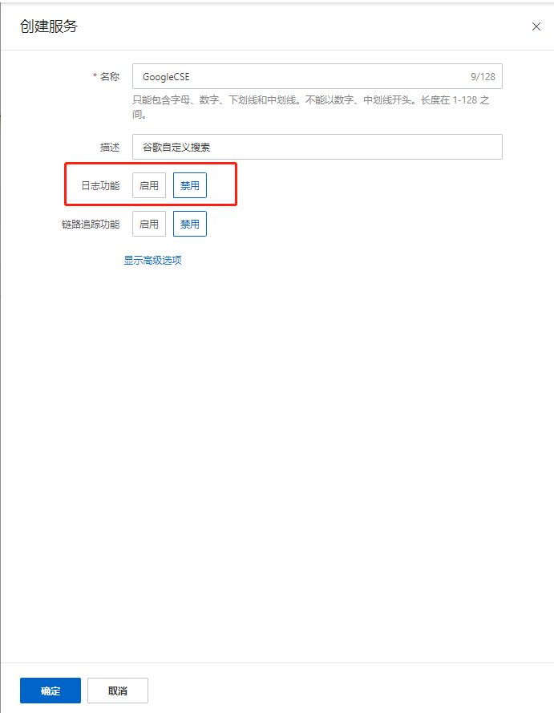
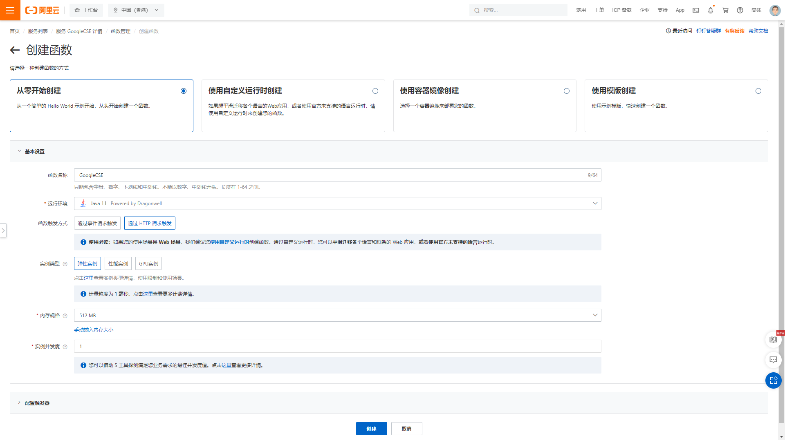
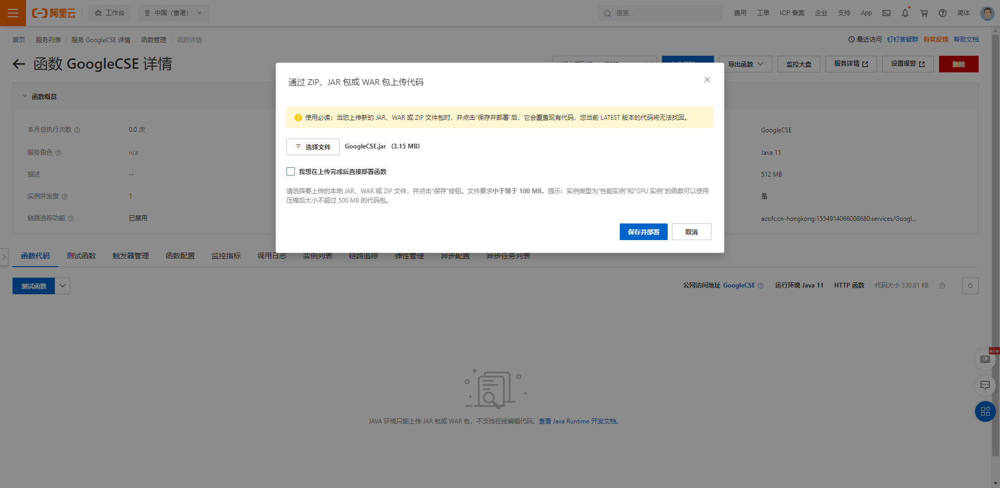
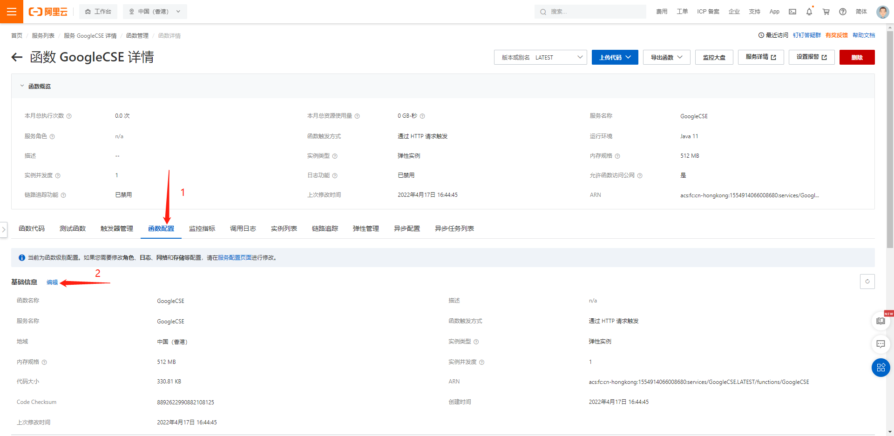
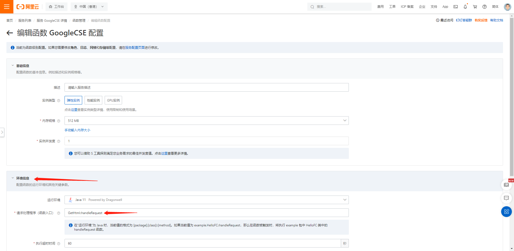
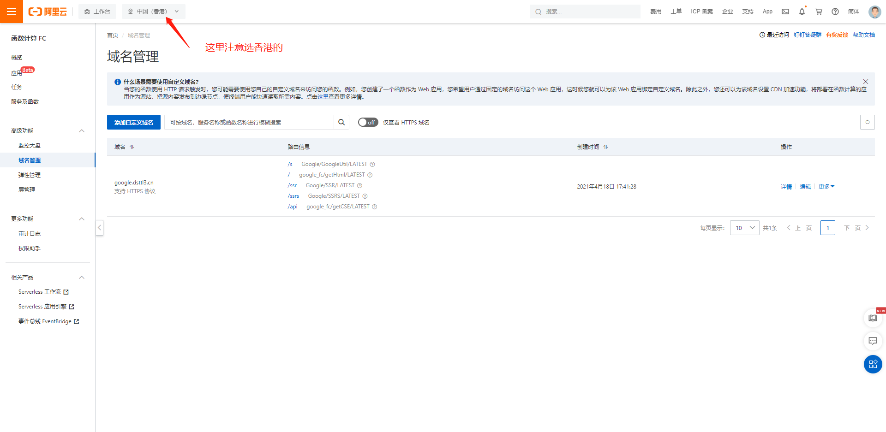

# GoogleCSE
 谷歌CSE自定义搜索

## 阿里函数计算FC
> 登录到阿里云函数计算fc控制台 https://fcnext.console.aliyun.com/overview  
> 创建服务一个服务  
>   
> 日志功能是需要付费的，这里需要关闭掉  
>    
> 创建服务一个函数  
>    
> 上传代码  
>   
> 配置函数  
>   
> 请求处理程序（函数入口） `GetHtml::handleRequest`  
>   

## 配置自定义域名
> https://fcnext.console.aliyun.com/cn-hongkong/domains  

>   

>   