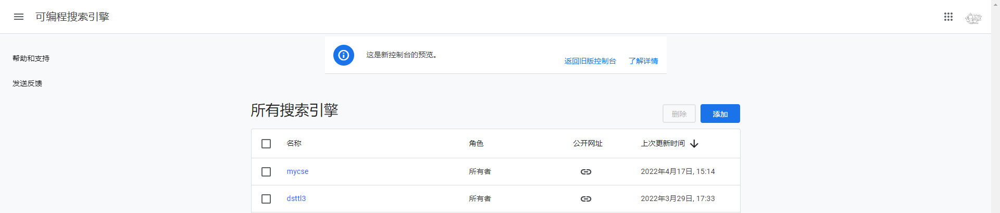
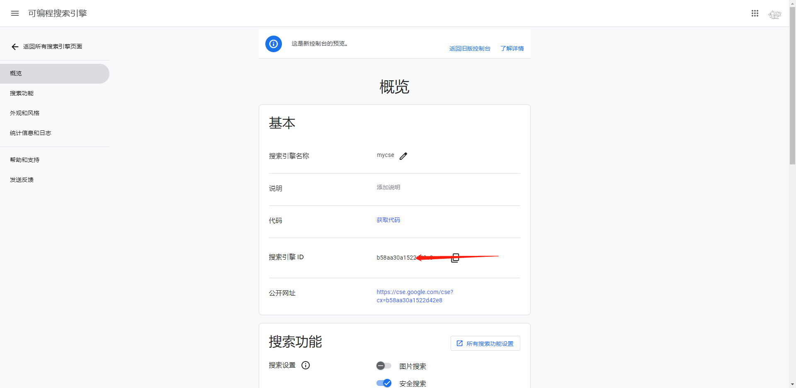
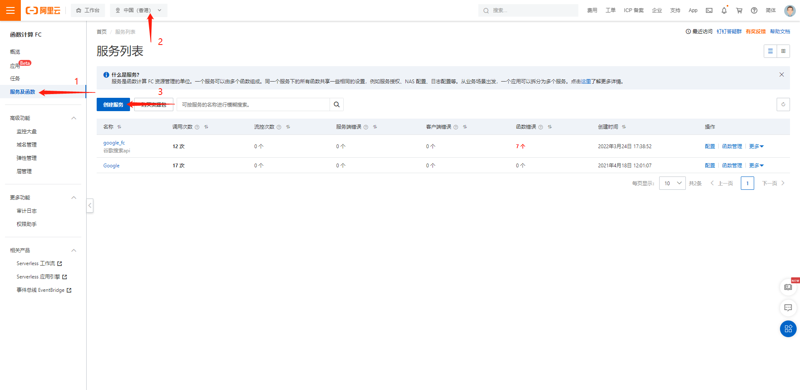
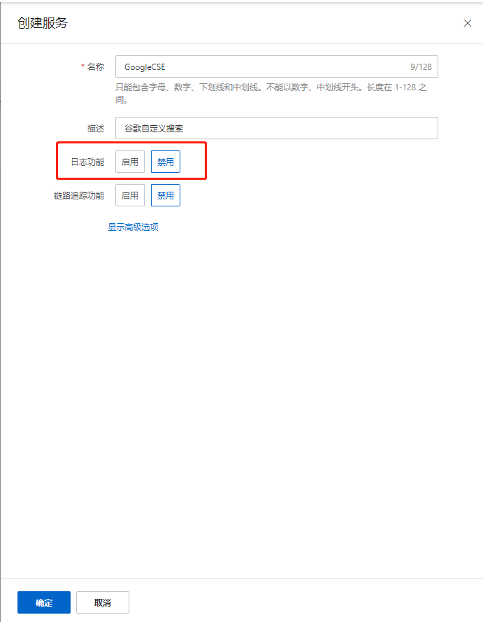
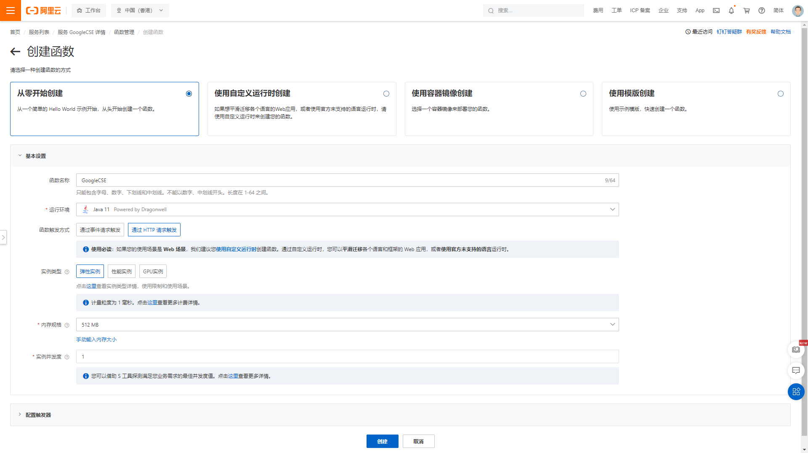
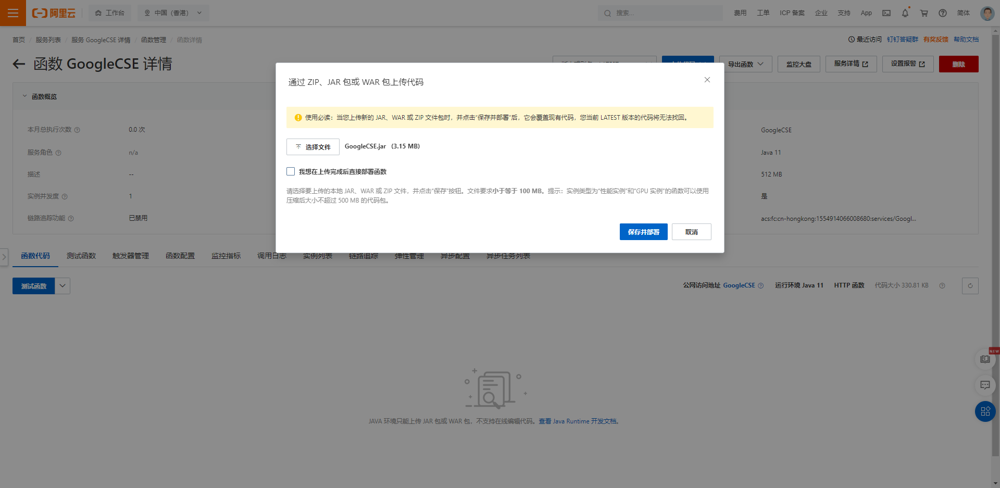
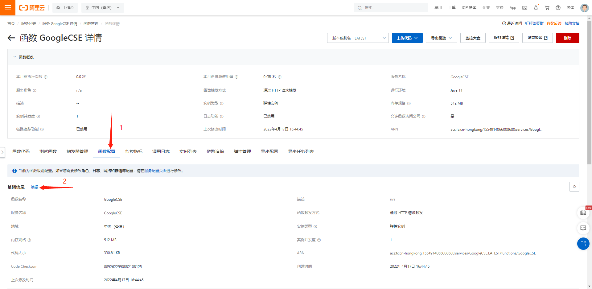
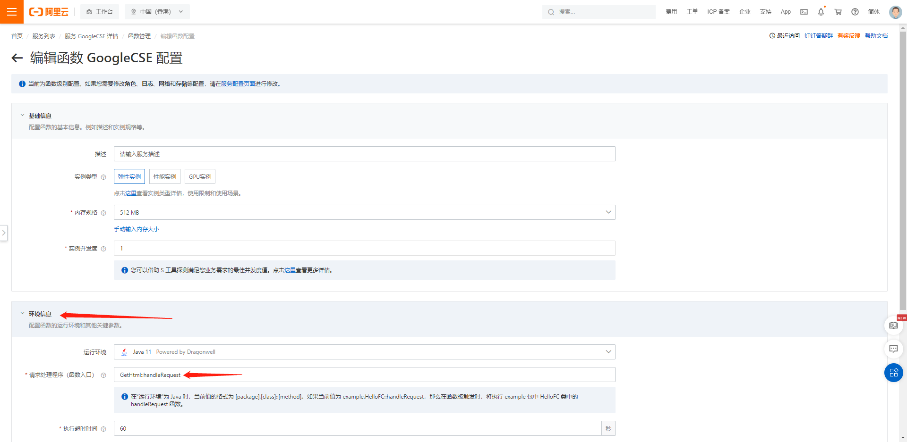
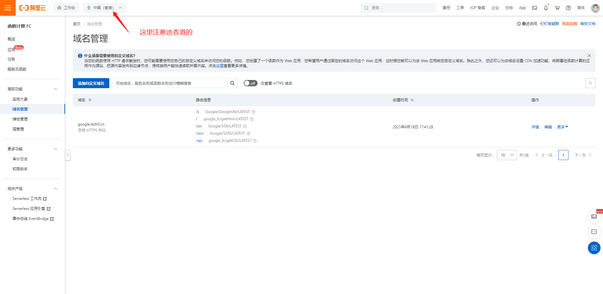

# 谷歌可编程搜索引擎

## 登录谷歌可编程搜索引擎官方地址获取自己的搜索引擎ID
> https://cse.google.com/  
> 自定义自己的搜索引擎（需科学上网）  
> 添加一个自己的搜索引擎  

> 获取自己的搜索引擎 ID  

## 获取代码

## 阿里函数计算FC
> 登录到阿里云函数计算fc控制台 https://fcnext.console.aliyun.com/overview  
> 创建服务一个服务  
>   
> 日志功能是需要付费的，这里需要关闭掉  
>    
> 创建服务一个函数  
>    
> 上传代码  
>   
> 配置函数  
>   
> 请求处理程序（函数入口） `GetHtml::handleRequest`  
>   

## 配置自定义域名
> https://fcnext.console.aliyun.com/cn-hongkong/domains  

>   

>   